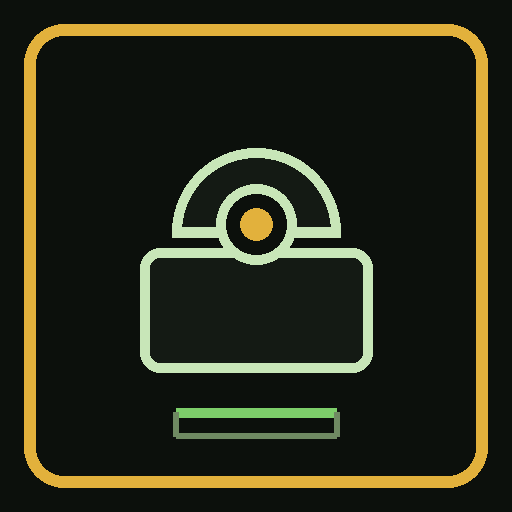

# Tuya RTSP Bridge

<p align="center">
  
</p>


[](LICENSE)
[](https://github.com/DanEng1982/tuya-rtsp-bridge/actions/workflows/ci.yml)
[](https://github.com/DanEng1982/tuya-rtsp-bridge/stargazers)
[](https://github.com/DanEng1982/tuya-rtsp-bridge/issues)
[](README.md) [](README.de.md) [](README.nl.md) [](README.fr.md) [](README.es.md) [](README.pt.md) [](README.it.md) [](README.pl.md) [](README.cs.md) [](README.ru.md) [](README.uk.md) [](README.id.md) [](README.zh.md) [](README.hi.md) [](README.ja.md) [](README.ko.md) [](README.he.md) [](README.yi.md)

**Turn any Tuya / Smart Life / iSmartLife camera into a normal RTSP camera** — so Frigate, Agent DVR, go2rtc, Home Assistant, or VLC can use it.

No firmware flash. No ONVIF (stock Tuya does not offer it). Scan a QR code once, then copy an RTSP URL.

| You are… | Start here |
|---|---|
| Just want it to work | [5-minute setup](#5-minute-setup) |
| Home-lab / NVR tinkerer | [docs/nvr.md](docs/nvr.md) |
| Developer | [docs/architecture.md](docs/architecture.md) · [CONTRIBUTING.md](CONTRIBUTING.md) |

This repository ships **no** accounts, device IDs, or home IPs.

## Why cheap Tuya cameras need this

Those €20–40 “Smart Life” cams look like IP cameras. They are not. Stock firmware has **no ONVIF** and **no RTSP checkbox**. Live view is the vendor app and a cloud path you do not control. A second phone or a “cloud NVR” often means a subscription — or it steals the only live session.

You paid for a sensor on your wall. Recording should land on **your** disk.

This app is a small local bridge: scan a QR code in the app you already have, then every camera is a normal URL for Frigate, Agent DVR, go2rtc, Home Assistant, or VLC:

```
rtsp://<this-pc>:8554/<CameraName>/hd
```

Signaling still uses Tuya. When you watch from this PC, video typically stays on the LAN. Full story: [docs/why.md](docs/why.md) · [docs/warum.md](docs/warum.md).

### The app

First run — language, region, QR, then confirm in Smart Life. No cameras yet:


After login — demo names only (`Front yard`, `Driveway`). Preview panes stay black here on purpose (no live video in the docs):


## Credits

The RTSP engine is **[tuya-ipc-terminal](https://github.com/seydx/tuya-ipc-terminal)** by **[seydx](https://github.com/seydx)** (MIT), vendored at commit `d65b3e9` with three documented local patches. See [CREDITS.md](CREDITS.md) and [NOTICE.md](NOTICE.md).

---

## What you get

```
Phone (Smart Life) ──QR──► this PC ──RTSP :8554──► Frigate / Agent DVR / VLC
                              │
                              └── LAN PTZ (port 6668) when the camera allows it
```

- HD: `rtsp://<this-pc>:8554/<CameraName>/hd` (usually HEVC 1080p)
- SD: `rtsp://<this-pc>:8554/<CameraName>/sd` (H.264, smaller)
- All cameras share **one** bridge IP; only the path changes
- Live preview uses bundled VLC on Windows Setup; on Linux install `vlc`
- English, Deutsch, Nederlands, Français, Español, Português, Italiano, Polski, Čeština, Русский, Українська, Bahasa Indonesia, 简体中文, हिन्दी, 日本語, 한국어, עברית, ייִדיש

Signaling still uses Tuya cloud. When you watch from this PC, video typically stays on your LAN.

## Honest limits

- Stock firmware has **no ONVIF** and **no camera-native RTSP**
- Many models output about **10 fps** in the HD bitstream — that is the camera, not this app
- VLC 3 sometimes shows a black window on HEVC/RTSP; Agent DVR / Frigate are the intended viewers
- Preview needs VLC; recording should happen in your NVR, not on the bridge

Supported login regions: Western Europe, Eastern Europe, USA West, USA East, China, India.

---

## 5-minute setup

### 0. You need

1. Windows 10/11 **or Arch Linux** (other Linux: use `./launch.sh` or Docker)
2. A Tuya Smart or Smart Life account that already sees the cameras

Windows users do **not** install Python, VLC, or ffmpeg. That is all inside the Setup.

### 1. Install

- **Windows:** `TuyaRtspBridge-Setup.exe` from [Releases](../../releases) — next, next, finish. Details: [docs/windows.md](docs/windows.md)
- **Docker (Linux / HA host):** [docs/docker.md](docs/docker.md) — `docker compose up -d --build`
- **Arch Linux:** [docs/arch-linux.md](docs/arch-linux.md) — `./launch.sh` or `packaging/arch/PKGBUILD`
- **From source:** see [Install from source](#install-from-source)

Windows install dir: `%LOCALAPPDATA%\Programs\TuyaRtspBridge`.  
Logins: `%APPDATA%\TuyaRtspBridge\` (Windows) or `~/.local/share/tuya-rtsp-bridge/` (Linux). Never in git.

### 2. Log in

1. Start **Tuya RTSP Bridge**
2. Pick the same region as in the phone app (Germany “Western Europe” → **EU**)
3. Click **Create QR**
4. In Smart Life / Tuya Smart: scan, then **confirm**
5. Cameras appear with copy-paste HD URLs

If the QR “does nothing”, wait — the app polls until you confirm. Wrong region = empty camera list; try the other EU/US cluster.

### 3. Watch

Paste into Agent DVR / Frigate / go2rtc:

```
rtsp://127.0.0.1:8554/<CameraName>/hd
```

From another machine on the LAN, replace `127.0.0.1` with this PC’s IP. Prefer **RTP over TCP**.

Ready-made snippets: [docs/nvr.md](docs/nvr.md).

---

## Install from source

```bat
git clone https://github.com/DanEng1982/tuya-rtsp-bridge.git
cd tuya-rtsp-bridge
python -m venv .venv
.venv\Scripts\pip install -r requirements.txt
cd vendor\tuya-ipc-terminal
go build -o ..\..\bin\tuya-ipc-terminal.exe .
cd ..\..
launch.bat
```

Linux / Arch:

```bash
sudo pacman -S --needed python python-pip tk go vlc ffmpeg   # Arch
chmod +x launch.sh
./launch.sh
```

Need Go only to build the engine. Release builds on Windows already include the `.exe`.

## Docs

| Doc | Audience |
|---|---|
| [docs/why.md](docs/why.md) / [warum.md](docs/warum.md) | Why this exists (plain language) |
| [docs/getting-started.md](docs/getting-started.md) | First run, Wi‑Fi move, PTZ |
| [docs/faq.md](docs/faq.md) | Black VLC, empty list, “only 10 fps” |
| [docs/nvr.md](docs/nvr.md) | Frigate, Agent DVR, go2rtc |
| [docs/architecture.md](docs/architecture.md) | How the pieces fit |
| [docs/api.md](docs/api.md) | Local HTTP API `:8787` |
| [docs/windows.md](docs/windows.md) | Foolproof Windows Setup.exe (Python + VLC + ffmpeg) |
| [docs/brand.md](docs/brand.md) | Logo, icon, social preview |
| [docs/docker.md](docs/docker.md) | Docker Compose (Linux host / Desktop ports) |
| [docs/arch-linux.md](docs/arch-linux.md) | Arch: launch.sh + PKGBUILD |
| [DEPENDENCIES.md](DEPENDENCIES.md) | Licenses (all redistributable or not shipped) |
| [docs/nl](docs/nl/) · [docs/fr](docs/fr/) · [docs/es](docs/es/) · [docs/pt](docs/pt/) · [docs/it](docs/it/) · [docs/pl](docs/pl/) · [docs/cs](docs/cs/) · [docs/ru](docs/ru/) · [docs/uk](docs/uk/) · [docs/id](docs/id/) · [docs/zh](docs/zh/) · [docs/hi](docs/hi/) · [docs/ja](docs/ja/) · [docs/ko](docs/ko/) · [docs/he](docs/he/) · [docs/yi](docs/yi/) | NL / FR / ES / PT / IT / PL / CS / RU / UK / ID / 中文 / हिन्दी / 日本語 / 한국어 / עברית / ייִדיש |
| [SECURITY.md](SECURITY.md) | What not to commit |

## Join in

If this un-clouded a camera you already own, **star the repo** so the next person finds it.

Then pick one:

- [Report a camera model](https://github.com/DanEng1982/tuya-rtsp-bridge/issues/new?template=camera.yml) (Smart Life / Tuya Smart + region)
- [Suggest a feature](https://github.com/DanEng1982/tuya-rtsp-bridge/issues/new?template=feature.yml)
- Add a language or fix a string in `src/i18n.py` — see [CONTRIBUTING.md](CONTRIBUTING.md)

PRs from anywhere are welcome. English in code comments; UI already speaks eighteen languages.

## License

Our code: MIT ([LICENSE](LICENSE)).  
Vendored engine: MIT, Copyright (c) 2025 seydx — full text in [NOTICE.md](NOTICE.md) and `vendor/tuya-ipc-terminal/LICENSE`.

Tuya, Smart Life, and iSmartLife are trademarks of their owners. This project is not affiliated with Tuya Inc. or with seydx beyond using their MIT-licensed engine with credit.
