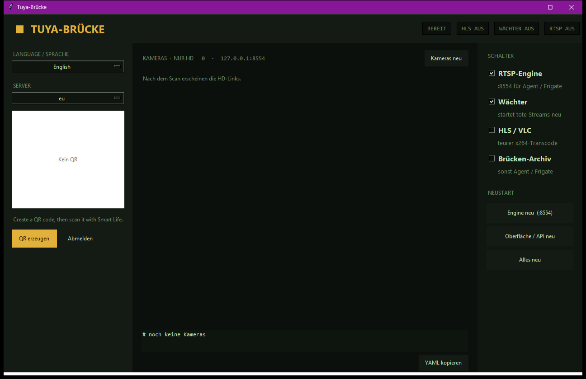
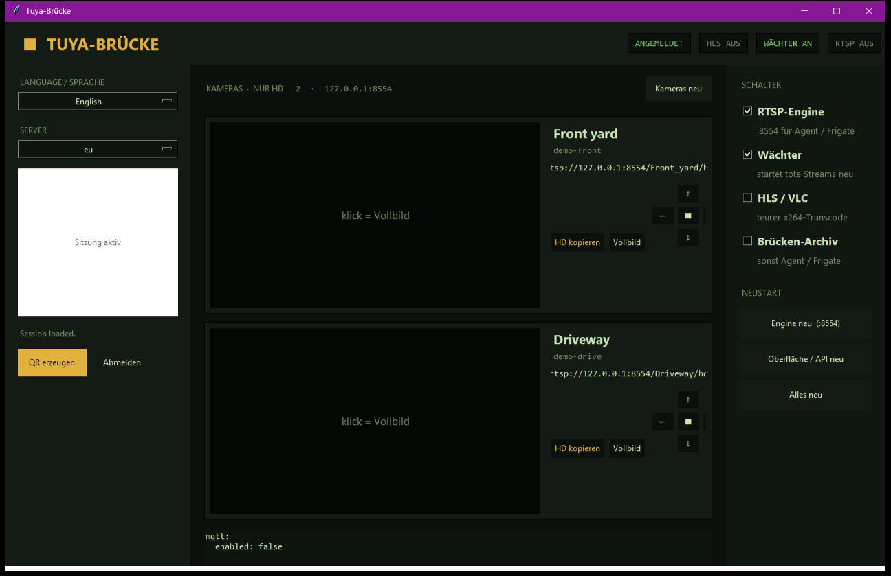

# Warum es das gibt

Billige Tuya- / Smart-Life- / iSmartLife-Kameras sind leicht zu kaufen und schwer *zu besitzen*.

Die Schachtel sieht aus wie eine normale IP-Kamera. In der Firmware ist das Nützliche hinter der Cloud versperrt:

- **Kein ONVIF** auf der Stock-Firmware.
- **Kein Kamera-eigenes RTSP**, das du in Frigate, Agent DVR, go2rtc oder Home Assistant kleben kannst.
- Die offizielle App will Konto, Handy und einen Weg über Server, die du nicht kontrollierst.
- Ein zweites Handy oder ein „Cloud-NVR“ heißt oft Abo — oder ein zweiter Zuschauer, der die Live-Session klaut.

Du hast einen Sensor an *deiner* Wand bezahlt. Aufnehmen solltest du auf *deiner* Platte können.

**Tuya RTSP Bridge** ist ein kleines lokales Programm (Windows oder Arch Linux). Einmal QR in derselben App scannen, die du schon nutzt. Danach hat jede Kamera eine normale URL:

```
rtsp://<dieser-PC>:8554/<Kameraname>/hd
```

Die klebst du in Frigate, Agent DVR, go2rtc, VLC oder Home Assistant. Bewegung, Archiv und Push bleiben in Software, die *du* gewählt hast.

## Was du davon hast

| Ohne | Mit |
|---|---|
| Live nur in der Cloud-App | Lokales RTSP im LAN |
| Festgenagelt auf die Hersteller-App | Jeder NVR mit RTSP |
| Kein ONVIF | Brauchst du nicht |
| Zweiter Cloud-Zuschauer = Lag / tote Session | Eine Engine, viele lokale Clients |
| Aufnahmen irgendwo | Aufnahmen auf NAS / Frigate / Agent |
| „Geht, bis die App sich ändert“ | Die RTSP-URL bleibt |

Die Anmeldung läuft weiter über Tuya. Wenn du von diesem PC schaust, bleibt das **Video** typischerweise Kamera → Rechner im LAN. Günstige Hardware, eigenes Archiv.

## Was es nicht ist

- Kein Firmware-Flash, kein Jailbreak, kein ONVIF.
- Kein 60-fps-Versprechen — viele dieser Cams liefern etwa **10 fps** HD-HEVC. Das ist die Kamera.
- Die Handy-App darf bleiben. Das hier ist der *lokale* Weg für den NVR.
- Nicht von Tuya Inc. Die Engine ist [seydx/tuya-ipc-terminal](https://github.com/seydx/tuya-ipc-terminal) (MIT).

## Für wen

- Alle, die eine Smart-Life-Cam gekauft haben und das RTSP-Häkchen suchen.
- Leute mit Frigate / Agent DVR / Home Assistant.
- Entwickler: lokale API `:8787`, MIT, forkbar.

## So sieht’s aus

Erster Start — Sprache und Region, QR erzeugen, in Smart Life scannen, bestätigen:



Nach dem Login — nur Platzhalter-Namen (kein Livebild, keine echten Geräte-IDs). HD-URL in den NVR kopieren:



Die Bilder stammen aus einer Demo-Sitzung. Keine Konten, keine Seriennummern, kein Video.

Weiter: [erste-schritte.md](erste-schritte.md) · [FAQ](faq.md) · [NVR](nvr.md)
